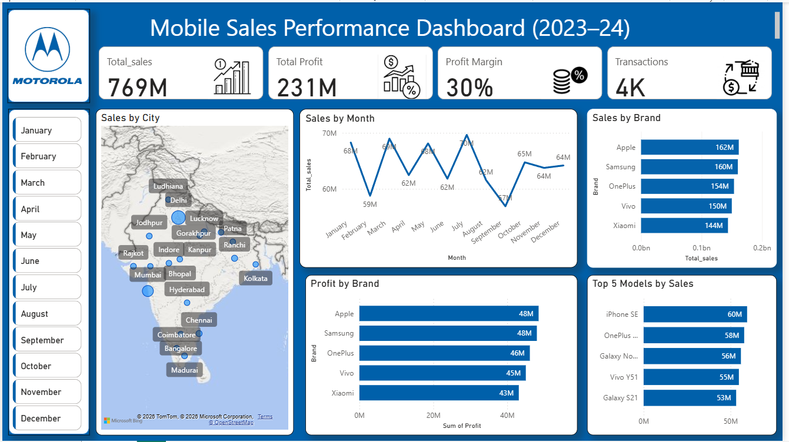

# 📊 Power BI Sales Dashboard

## 📌 Overview

This project analyzes sales data and provides meaningful business insights using Power BI.

---

## 🛠 Tools Used

* Power BI
* Microsoft Excel

---

## 📈 Key Insights

1. 📊 Total Sales: 769M
2. 💰 Total Profit: 231M
3. 📉 Profit Margin: 30%
4. 📅 Highest sales observed in July (~70M)
5. 📉 Lowest sales observed in September (~57M)
6. 🏆 Apple is the top-performing brand (162M sales)

---

## 🚀 Features

* Interactive city-wise map visualization
* Monthly sales trend analysis
* Brand and model performance comparison
* Dynamic filtering by month

---

## 🖼 Dashboard Preview

---

## 📂 Project Files

* `dashboard.pbix` → Power BI file
* `dashboard.png` → Dashboard preview

---

## 💡 Conclusion

This dashboard helps businesses track performance and identify growth opportunities through data-driven insights.
